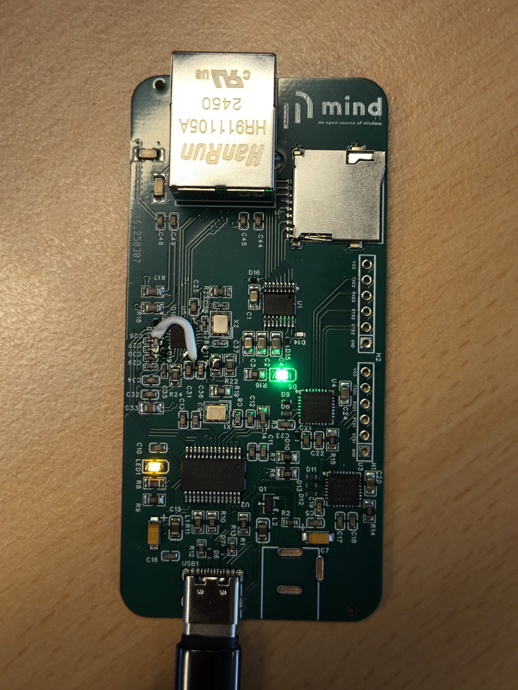

## MindHub
MindHub is an open-source hardware platform designed to provide embedded system engineers with essential tools for development, debugging, and testing in their daily projects. It integrates multiple interfaces to streamline connectivity and improve workflow efficiency.

Key Features:
* 2× USB-to-Serial Converters (CP2102) – Enable seamless communication with embedded devices, making debugging and firmware flashing easier.
* 1× USB-to-LAN Converter (RTL8152) – Provides a reliable wired network connection for embedded systems that require Ethernet connectivity.
* 1× microSD Card Reader (GL850G) – Supports external storage expansion, ideal for logging data, booting embedded operating systems, or transferring files.

MindHub simplifies development by consolidating commonly used peripherals into a single board, making it a valuable tool for both professionals and hobbyists working with embedded systems.
The boards is tested and verified.
## Images

